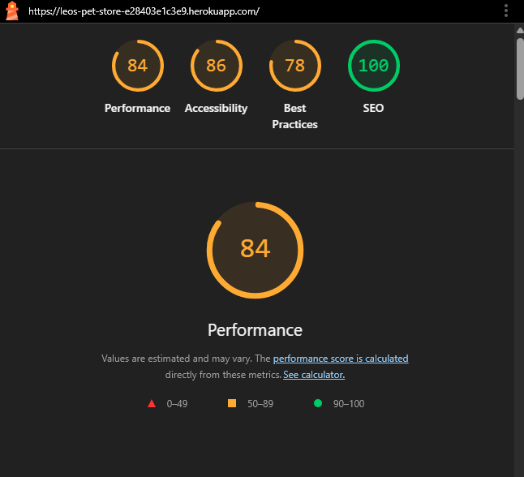
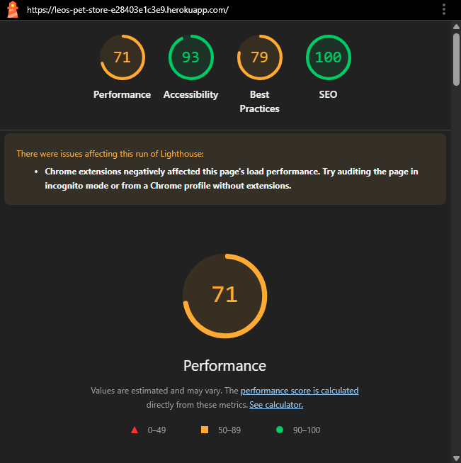

# Testing
## Manual Testing
 | Feature | Test  | Expected Result | Actual Result |
| -------------| ----- | ----- | :----: |
| Leos Pet Store  | Selecting logo on homepage |  directs user back to homepage |  Pass |
| Search | Using the search box | Entering a search returns expected result  |  Pass |
| Search no results | No search | Entering a no results search returns error message and shows all products  |  Pass |
| Navigation Links  | Selecting navigation links |  directs user to relevant pages |  Pass |
| All products  | Selecting all products |  directs user to all products |  Pass |
| Sort By  | Selecting the filter Sort |  successfully sort by price (Ascending only), and category options |  Pass |
| Shop Now button  | Selecting Shop Now button |  directs user to all  products page |  Pass |
| Privacy Policy | Selecting Privacy Policy |  directs user to Privacy Policy external link|  Pass |
| Sign up for our newsletter | selecting Sign up for our newsletter |  directs user Sign up for our newsletter page |  Pass |
| Our Facebook Page | Selecting  Our Facebook Page |  directs user to Our Facebook Page |  Pass |
| Wishlist | Selecting Wishlist |  directs user to Wishlist page |  Pass |
| Wishlist add product | Selecting add |  adds product to wishlist |  Pass |
| Wishlist remove product | Selecting remove |  removes product from wishlist |  Pass |
| Leave a review when signed in | Submitting review |  successfully submit and display review |  Pass |
| As Admin Delete Review | Deleting review |  successfully remove review |  Pass |
| Contact Us | Selecting Contact Us | directs user to Contact Us page  |  Pass |
| Contact form submission | submitting contact form | successfully sends submit to admin |  Pass |
| My account | Selecting my account as admin | displays product management which normal user cannot see  |  Pass |
| Add product | Adding a new product| successfully add new product to products page  |  Pass |
| Add Product | no image is selected | no image is used |  Pass |
| As Admin edit product | editing product |  successfully edited the product |  Pass |
| As Admin Delete product | Deleting product|  successfully remove product |  Pass |
| Register | Register for an account | selecting Register in my account directs user signup page |  Pass |
| Register | Registering as a new user | Registering as a new user sends email to user to verify |  Pass |
| Login | Login to an account | selecting Login in my account directs user to Login page |  Pass |
| Login | Login to an account | login as a new user form works |  Pass |
| Login as admin| Login to as admin gives access to product management | login as a new user form works |  Pass |
| Logout | message shown | Logging out message shown |  Pass |

## User story testing
### Admin
* As an admin I can manage users accounts so i can make any changes that the user needs me to
   > Admin can manage user accounts from the admin
* As an admin I want to create/edit/delete products using a form with validation.
   > Admin can add, edit, delete and update products on the site
* As an admin I want to be alerted when products receive multiple downvotes so that I can review, unlist, or delete them if necessary.
   > Admin can see red border around products that recieve 4 downvotes
* As an admin I can list or unlist live products if they are out of stock or need reviewing
   > Unlisting works (only if you click unlist, dont click update product after unlisting)

## User story testing
### User
* As a site user I want to browse products so I can find items I’m interested in.
   > A user can view products in multiple ways
* As a site user I want to search for a product so I can quickly locate specific items.
   > Searching products works
* As a site user I want to easily register for an account so I can start shopping quickly.
   > Registering works
* As a site user I want to see a clear message if I go to a broken or wrong link, So that I don’t get confused and can find my way back to the site.
   > 404 page displays if the user goes to a borken link
* As a site user I want a personalized profile so I can view and manage my details and orders easily.
   > User can add specific details to their profile
* As a site user I want to securely pay for my order via Stripe so I can complete my purchase.
   > Payment through stripe works
* As a site user I want to easily log in and out so I can access my account securely and conveniently.
   > Logging in and out works as intended
* As a site user I want to receive a clear message after purchase so I know if it was successful or not.
   > Clear message and order summary
* As a site user I want to log in to see my order history.
   > User can view their order history
* As a site user I want to add products to my cart so I can purchase multiple items at once.
   > User can add quantity of product to bag
* As a site user I want to sort products within a specific category so I can narrow down my options easily.
   > User can sort products into categories
* As a site user I want a responsive site so I can use it on different devices.
   > Site works across multiple devices
* As a site user I want to be able to leave reviews on products i buy
   > User can leave a review on products they buy and add a picture
* As a site user I want a contact form so i can contact the owners of the site regarding any issues i may have.
   > User can navigate to contact us and send a message that goes to the admin
* As a customer i want to be able to wishlist items for later
  > User can add or remove items to or from their wishlist

## Functionality testing

While building this project, I have been using Chrome, and chrome dev tools to help with debugging issues. Testing responsiveness was done using chrome devices.

 

  
Click here for Lighthouse results

 Desktop

  

Mobile

  
 
  
 

  

  
Click here for Markup results

   

  
 

  

  
Click here for CSS results 

  

  
 

### Javascript validation
I used JSlint to validate javascript found in some apps

* bag app - semi colon warning

* blog app -  semi colon warnings

* base.html - zero warnings

* newsletter - 8 warnings but the code is directly from mailchimp

* checkout - semi colon warnings

* products - semi colon warnings

* profiles - no warnings

### Python
[ CI Python linter ](https://pep8ci.herokuapp.com/) was used to test python code

## Bugs

For this project there were so many bugs I encountered from the beginning though some were minor. Some of them I ended up taking them to tutor support whom have been very helpful.

### Bug 1
Toasts not showing/displaying - Having all the code set up properly and checking in chrome dev tools I could see they were rendering in my template however not displaying. To fix this (from tutor support), There is a script in base.html to show any toasts in postloadjs and in the template I wanted them to show up I had a  without {{ block.super }} in it. This resulted in the block from base.html being overwritten by a blank block. Removing the blank block in the detail template fixed it.

### Bug 2

In testing my search box and product management - error handling was not working each time I was testing the search box and product management whereby the error toast was rendering but not display , also the header would just disappear. The fix was simple though it took me hours, I searched via Code Institute slack and found out someone made my mistake as well of missing out a closing div tag in toast error.

 

 
### Bug 3

I had errors in validating html and to resolve them I had to put ul tags in mobile header which led to the bug below. To fix this I added padding to icons(search, my account, bag)

### Bug 4

Double orders in admin panel

Solution: In checkout views.py in the checkout function, 2 following lines of code fixed it

### Bug 5

Contact form resubmission on page refresh. To fix this according to [the solution from stack overflow](https://stackoverflow.com/questions/5823580/django-form-resubmitted-upon-refresh)
I needed to use a return HttpResponseRedirect,which I added to my view after the form is submitted.

### Bug 6
Anonymous user not iterable error whereby users not logged in could receive error when checking out, they would not receive a payment confirmation yet the order would have been created behind the scenes. To fix- In checkout success function in views.py I added an if statement to check if user is aunthenticated:(  if request.user.is_authenticated) and attach the profile to user.

